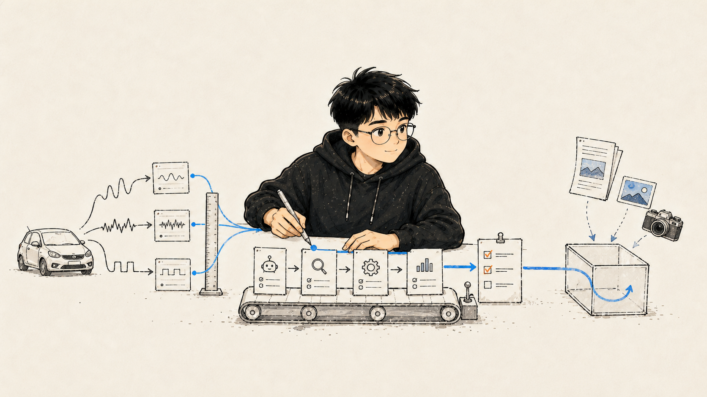
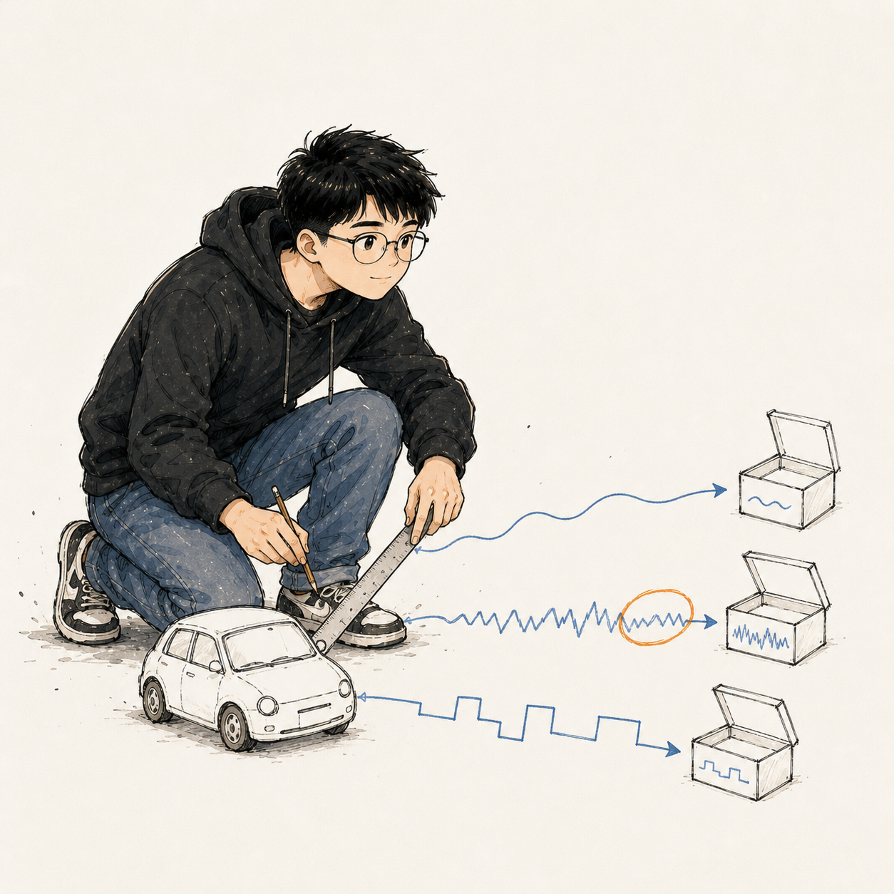
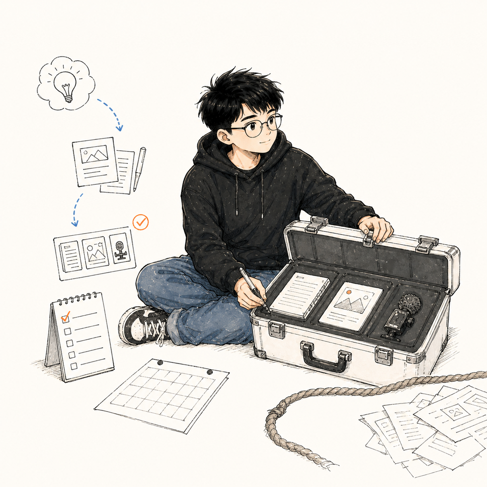

<p align="center">
  
</p>

<h1 align="center">雪沐江南 · Xuemu_Lab</h1>

<p align="center">
  AI 汽车技术视觉架构师｜工程科普、Agent 工作流与自媒体产品构建者
</p>

<p align="center">
  把汽车工程、视觉叙事与 Agent 工作流，做成可复用的内容产品和开源工具。
</p>

<p align="center">
  <a href="https://art.zedpapa.top">作品与会员档案</a> ·
  <a href="https://github.com/aierlanjiu?tab=repositories">全部开源项目</a> ·
  <a href="https://art.zedpapa.top">合作入口</a>
</p>

---

## 我在做什么

我长期工作在三个相互连接的现场：汽车工程知识、AI Agent 工作流、可以真实交付的内容产品。这里不陈列空泛的“AI 能力”，只公开能够安装、运行、验证和继续开发的方法。

### 01｜汽车技术视觉架构

<p align="center">
  
</p>

从 NVH、动力总成、空气动力学到车身计算美学，我把工程对象拆成证据链，再翻译成读者能看懂、创作者能复用的视觉结构。重点不是“把图做得像科技”，而是让几何、载荷、气流、材料和判断彼此对应。

**闭环：** 工程事实 → 技术消歧 → 视觉证据 → 编辑表达 → 事实边界校核

### 02｜Agent 工作流构建

<p align="center">
  
</p>

把一次性的好提示词，改造成 Agent 能安装、能调用、能检查结果的工作方法。公开仓库尽量包含 `SKILL.md`、Agent 配置、教程、模板、示例和安全边界，而不是只留一页简介。

**闭环：** 任务合同 → 技能路由 → 工具执行 → 产物 QA → 失败返工

### 03｜内容产品与商业交付

<p align="center">
  
</p>

我把选题、研究、写作、视觉、分发和商务边界组织成一套可以真正上手的自媒体方法。经验来自汽车内容实践、商业合作与训练营交付，但公开版只保留可迁移的方法和虚构案例，不公开客户资产与私有数据。

**闭环：** 用户问题 → 内容承诺 → 生产系统 → 可售交付 → 复盘资产化

---

## 从这里开始

### 雪沐创作技能工坊

[`xuemu-creative-skills`](https://github.com/aierlanjiu/xuemu-creative-skills) 不是技能简介合集，而是 **11 项可安装的 Agent 创作方法**。目前覆盖汽车技术内容、动力总成 NVH、社媒卡片、怪诞手绘、公众号信息卡、专利解读、自媒体变现、交付打包与文本编辑。

```bash
git clone https://github.com/aierlanjiu/xuemu-creative-skills.git
cd xuemu-creative-skills
sh install.sh --list
sh install.sh automotive-content-master
```

[打开完整技能目录](https://github.com/aierlanjiu/xuemu-creative-skills) · [浏览在线工坊](https://aierlanjiu.github.io/xuemu-creative-skills/)

---

## 重点项目

每个项目都按“问题、交付、上手入口”组织。展开后可以直接判断它是否适合你的任务。

<details open>
<summary><strong>Automotive Visual Decomposer｜一个汽车概念，五套可验证视觉路径</strong></summary>

<br>

**解决什么：** 避免同一汽车概念只换颜色和表面风格，把技术主题翻译成真正不同的信息架构。

**交付什么：** 五套汽车视觉系统、3:4 与 16:9 画幅选择、提示词输出模式、同一“线控转向”概念的完整样张与公开安全边界。

**怎么开始：** [查看仓库](https://github.com/aierlanjiu/automotive-visual-decomposer) · [查看在线案例](https://aierlanjiu.github.io/automotive-visual-decomposer/)

</details>

<details>
<summary><strong>Vibration Test Data Summary｜从减速器振动数据到工程判断</strong></summary>

<br>

**解决什么：** 将测试台 Excel 数据清洗、统计与可视化，帮助识别敏感测点、扭矩、转速区和振动趋势。

**交付什么：** Python 数据处理模块、RMS 与分布分析、趋势拟合、图表输出和自动化 PPT 能力。仓库示例数据已脱敏，仅用于代码验证，不作为实测对标结论。

**怎么开始：** [查看工程仓库](https://github.com/aierlanjiu/Vibration-Test-Data-Summary)

</details>

<details>
<summary><strong>『律』Three.js Material Lab｜材质、声波与实时视觉实验</strong></summary>

<br>

**解决什么：** 在浏览器里探索折射、色散、PBR 材质、矩阵空间与音频驱动的视觉变化。

**交付什么：** 纯前端 Three.js 工作台、12 款材质、6 种声波形态、运镜控制与本地录制路径。

**怎么开始：** [查看仓库](https://github.com/aierlanjiu/threejs-material-lab) · [打开在线实验室](https://aierlanjiu.github.io/threejs-material-lab/)

</details>

<details>
<summary><strong>XuemuOS Community｜本地优先的内容任务操作系统</strong></summary>

<br>

**解决什么：** 把选题简报、任务状态、Mock 草稿和人工审核组织成一个可运行的本地工作台。

**交付什么：** 零运行时依赖的 Python API、静态前端、合成示例、Agent 配置、完整教程与安全扫描。社区版固定使用 Mock adapter，并默认拒绝真实发布。

**怎么开始：** [查看仓库](https://github.com/aierlanjiu/xuemuos-community) · [阅读在线教程](https://aierlanjiu.github.io/xuemuos-community/)

</details>

<details>
<summary><strong>Social Monetization Master｜创作者变现诊断与 B 端沟通技能</strong></summary>

<br>

**解决什么：** 找到创作者业务的关键变现瓶颈，并把范围、报价、修改和付款问题写成清晰的商务沟通。

**交付什么：** 可安装 Codex skill、诊断方法、模板、虚构案例、Agent 配置与教程。公开版不包含真实营收台账、客户对话和账号凭据。

**怎么开始：** [查看仓库](https://github.com/aierlanjiu/social-monetization-master) · [阅读在线教程](https://aierlanjiu.github.io/social-monetization-master/)

</details>

<details>
<summary><strong>Xuemu Creative Skills｜11 项可安装的创作方法</strong></summary>

<br>

**解决什么：** 让汽车内容、视觉插画、自媒体变现和交付打包从零散 Prompt 变成 Agent 可调用的方法。

**交付什么：** 11 项公共核心技能、安装器、OpenAI/Codex Agent 元数据、参考资料、模板、合成案例和三条组合工作流。

**怎么开始：** [查看技能工坊](https://github.com/aierlanjiu/xuemu-creative-skills) · [打开 GitHub Pages](https://aierlanjiu.github.io/xuemu-creative-skills/)

</details>

---

## 可安装工具生态

| 工具 | 它真正解决的问题 | 上手入口 |
| --- | --- | --- |
| **Xuemu Illustration Core** | 把文章或专业概念转成怪诞手绘的沟通目标、分镜、提示词与视觉 QA。公开版不含个人角色素材。 | [仓库](https://github.com/aierlanjiu/xuemu-illustration-core) · [教程](https://aierlanjiu.github.io/xuemu-illustration-core/) |
| **Wechat Manager Community** | 本地保存草稿，以令牌、CSRF、来源检查保护写操作，并将发布固定为 dry-run。 | [仓库](https://github.com/aierlanjiu/wechat-manager-community) · [在线教程](https://aierlanjiu.github.io/wechat-manager-community/) |
| **XuemuLab Style Core** | 暖纸商业文档设计系统，包含 tokens、响应式 CSS、审计清单和 Agent 路由。 | [仓库](https://github.com/aierlanjiu/xuemulab-style-core) · [教程](https://aierlanjiu.github.io/xuemulab-style-core/) |
| **Racing Science Card** | 把赛车工程、赛事历史和人物故事转成三套科普卡片提示词，并离线批量导出。 | [仓库](https://github.com/aierlanjiu/racing-science-card-skill) · [教程](https://aierlanjiu.github.io/racing-science-card-skill/) |

---

## 我的工作原则

- **先证据，后视觉。** 视觉元素必须对应具体结构、物理现象或判断，不拿随机特效冒充工程感。
- **先合同，后 Agent。** 把输入、输出、工具、QA 和失败条件写清楚，再谈自动化。
- **先交付，后流量。** 内容必须能够帮助读者行动，也要能沉淀为教程、模板、工具或产品。
- **公开方法，不公开风险。** API Key、Cookie、真实客户资产、私有账号数据、本地绝对路径和内部发布能力永不进入公共仓库。

## 合作与交流

如果你正在做汽车技术内容、工程视觉、Agent skills、自媒体产品或训练营交付，可以从上面的公开项目开始复用，也可以通过 [art.zedpapa.top](https://art.zedpapa.top) 查看完整作品体系。

公开仓库用于学习、验证与二次开发。会员提示词、客户交付和内部生产配置遵循各自授权边界。

<p align="center">
  <strong>Xuemu_Lab · Engineering made visible. Methods made reusable.</strong>
</p>
